# Bukal One Day Hackathon Plan

Implementation progress is tracked in the [step-by-step implementation checklist](implementation-checklist.md). The required post-milestone quiz types, local-AI answer evaluation, and yearly activity profile are defined in [Quiz Types and Local Profile](quiz-types-and-profile.md).

## Core Requirement

The Android application must not include an AI model in its APK.

- The APK contains the interface, document processing, quiz logic, and LiteRT-LM runtime.
- The APK contains no generative or embedding model weights.
- On first use, the learner downloads the default quiz model and the fixed embedding model package.
- Downloaded models are stored in the application's private app-specific storage.
- After the fixed embedding model and at least one quiz model are installed, quiz generation and document search work without an internet connection.
- Internet access is required only to download or update a model.
- Learning materials, generated quizzes, and attempt history are not uploaded to a server.

## One Day Goal

By the end of the hackathon, the user should be able to:

1. Install and open the model-free application.
2. Download and verify the required local quiz and embedding models.
4. Import a TXT learning material.
5. Select a passage from the material.
6. Generate five multiple-choice questions locally.
7. Answer the questions and receive a score.
8. Reopen the selected source passage after answering.
9. Review a simple local attempt history.
10. Repeat the workflow in airplane mode.

This is the first working milestone and remains the ten-hour hackathon target. The required product scope continues after this milestone with the additional quiz types, local-AI answer evaluation, and local profile described below.

## Required Product Expansion

After the first multiple-choice milestone works end to end, the learner must also be able to:

1. Choose one or more quiz types before generation.
2. Request five questions distributed across multiple choice, fill in the blank, identification, matching, and explanation; continue with the successful questions when individual slots exhaust their retries.
3. Receive deterministic checking for multiple choice and matching.
4. Have fill in the blank, identification, and explanation responses evaluated by the downloaded local quiz model against a hidden reference answer and the top five source matches.
5. Receive a boolean correct or incorrect result, with `false` used whenever the model is unsure, and request a short explanation only when needed.
6. Request a short local hint that does not reveal the answer.
7. Open a local Profile page with a GitHub-style yearly activity heatmap based on completed quiz attempts.
8. View current and longest active-day streaks without creating an account or uploading activity.
9. Search imported documents semantically using overlapping text chunks embedded on-device with Granite Embedding 311M Multilingual R2.

The detailed contracts and UI rules for this expansion are authoritative in [Quiz Types and Local Profile](quiz-types-and-profile.md).

## Scope

### Include During the Hackathon

- Native Android application
- Non-bypassable setup requiring the fixed embedding model and at least one quiz model
- Install, select, switch, and remove supported quiz models
- Separate model downloads
- Download progress and error state
- Model file-size and SHA-256 verification
- TXT file import
- Passage selection
- Five multiple-choice questions
- Selected source-passage access
- Quiz scoring
- Simple local attempt history
- Airplane-mode operation after setup

### Include Only If Time Remains

- Text-based PDF import
- PDF page references
- Better passage selection
- UI polish
- GPU acceleration

### Build After the Hackathon

- Fill-in-the-blank questions
- Identification questions with local-AI evaluation
- Matching questions
- Explanation questions with local-AI evaluation
- On-demand local hints during an active quiz
- Quiz-type selection and mixed-type quiz generation
- Local profile with yearly activity heatmap and streaks
- DOCX import
- PPTX import
- Filipino-language evaluation
- Multiple-document library
- Local semantic document search
- Full quiz editing
- Production-level download recovery
- Wider device testing

### Excluded

- OCR
- Scanned or image-only documents
- Handwriting recognition
- Cloud accounts
- Cloud synchronization
- Public quiz sharing
- Multiplayer quizzes
- Teacher dashboards
- Mastery prediction
- Review scheduling
- Formal examination use

## User Flow

### First Launch

1. The application checks the bundled quiz-model catalog and the fixed embedding model file.
2. It keeps the learner on **Set up offline AI** until the fixed embedding model and at least one quiz model are installed and verified.
3. Separate sections show quiz models and the fixed embedding model with download sizes, progress, selection, and verification states.
4. The application checks available storage only for each model it is about to download plus a safety buffer.
5. Android DownloadManager downloads each immutable `.litertlm` file and resumes interrupted transfers when possible.
6. The application verifies each file's exact size and SHA-256 checksum.
7. Failed, paused, or corrupted files expose retry/reinstall and never satisfy the gate.
8. The application opens Home when Granite and any one quiz model are **Installed and verified**.
9. LiteRT-LM loads only the model needed for the current operation.
10. Switching the selected quiz model applies to the next quiz; one quiz keeps the same model for generation, hints, and answer evaluation.

### Quiz Flow

1. The user taps **Import Material**.
2. Android's system file picker opens.
3. The user selects a TXT file.
4. Bukal extracts and separates its paragraphs.
5. Each passage receives a stable source identifier such as `TXT-P003`.
6. The imported lesson is added to Home without hiding previously imported lessons.
7. The user selects a passage.
8. The application first checks Room for a quiz already generated for that passage. If one exists, it opens the stored questions without running AI again.
9. Otherwise, the application requests each of the five questions from its own fresh, unsaved local-model session. Every user message contains only the selected passage text.
10. Each type-specific prompt returns one small JSON object.
11. The application rejects malformed or unsupported output and retries only that question up to twice. An exhausted slot is skipped without discarding successful questions.
12. The accepted full or partial quiz is saved locally and appears in History for later retakes.
13. The user answers the accepted questions.
14. The result screen shows the score and lets the learner reopen the selected source passage.
15. Checking atomically updates the same quiz record with its latest score and retained highest score.

### Expanded Quiz and Profile Flow

1. The learner selects one or more quiz types before generation.
2. Bukal distributes five requested questions across the selected types.
3. Bukal requests each question from a fresh, unsaved model session using the prompt for its assigned type, with the selected passage as the complete user message.
4. The application validates each minimal type-specific JSON object and retries only the invalid question up to twice. It continues with a partial quiz and reports failed slots.
5. During answering, the learner may request a short hint from a separate fresh, unsaved session.
6. Multiple choice and matching are checked deterministically.
7. For fill in the blank, identification, and explanation, Granite retrieves the five closest indexed chunks from the selected passage, then the local quiz model evaluates the response against the reference answer and only those matches.
8. The result screen shows the boolean local-AI verdict and offers an on-demand, source-grounded **Explain** action.
9. The generated question set is saved before answering; completion adds its latest score, highest score, completion timestamp, and local date.
10. History shows one saved or completed quiz per passage. Retakes reuse its stored questions and update that row instead of creating another History item.
11. Profile derives yearly heatmap intensity and streaks from completed attempts.

### Document Search Flow

1. Imported passage text is split into ordered, overlapping search chunks.
2. Granite Embedding 311M Multilingual R2 creates one vector for each chunk on-device.
3. A learner's query is embedded with the same model and dimensions.
4. The app ranks compatible chunk vectors by cosine similarity and opens the matching source passage.
5. No query, passage, or embedding is sent to a server.

## Architecture

```mermaid
flowchart LR
    A["Pinned model metadata inside APK"] --> B["Required model setup screen"]
    B --> V["DataStore preferences"]
    B --> C["Android DownloadManager"]
    C --> D["App model folder"]
    D --> E["File size and SHA-256 verification"]
    E --> F["LiteRT-LM engine"]

    G["Android system file picker"] --> H["Supported text extractor"]
    H --> I["Passage chunker and source IDs"]
    I --> X["Overlapping search chunks"]
    X --> Y["Granite embedding engine"]
    Y --> Z["Local semantic search"]
    I --> J["User selects passage and quiz types"]
    J --> K["Typed prompt builder"]
    F --> L["Local model generation"]
    K --> L

    L --> M["JSON parser"]
    M --> N["Common and type-specific validators"]
    N --> O["Type-aware quiz interface"]
    O --> P["Deterministic answer evaluator"]
    O --> R["Top-5 passage chunk retrieval"]
    R --> W["Local-AI answer evaluator"]
    P --> S["Results and selected source passage"]
    W --> S
    S --> U["Room / local SQLite database"]
    U --> Q["Local attempt history"]
    U --> T["Yearly activity profile"]
```



There is no backend, cloud database, or project server. Room uses a private local SQLite database on the device.

## Main Components

| Component | Responsibility |
|---|---|
| `ModelCatalog` | Lists tested models and their metadata |
| `ModelDownloadManager` | Downloads, tracks, verifies, and deletes models |
| `ModelEngineManager` | Opens and closes the selected LiteRT-LM engine |
| `DocumentImporter` | Copies supported files from Android's system picker into private app storage and coordinates persistence |
| `DocumentTextExtractor` | Extracts strict UTF-8 TXT, text-based PDF pages, DOCX body paragraphs, and PPTX slide text without OCR |
| `PassageChunker` | Creates bounded passages and stable source IDs |
| `QuizConfig` | Stores selected quiz types and their required counts |
| `PromptBuilder` | Produces strict typed-question, answer-evaluation, and hint instructions |
| `QuizGenerator` | Runs local inference |
| `QuestionValidator` | Rejects invalid common or type-specific model output |
| `DeterministicAnswerEvaluator` | Checks multiple choice and matching |
| `AiAnswerEvaluator` | Retrieves the top five compatible chunks from the selected passage, then evaluates fill in the blank, identification, and explanation locally against those matches and the hidden criteria |
| `EmbeddingModelManager` | Verifies and loads the pinned local embedding model package |
| `SearchIndexer` | Splits passages into overlapping chunks and stores one Granite vector per chunk |
| `DocumentSearch` | Embeds a query and ranks compatible local chunk vectors by cosine similarity |
| `BukalDatabase` | Room database backed by SQLite with the six tables defined in the reviewed schema |
| Room DAOs | Save and query structured learning data, history, daily activity, and streak inputs |
| `SettingsStore` | Stores small application preferences with DataStore |
| `ActivitySummary` | Derives yearly daily counts and streaks from completed attempts |
| Compose screens | Provide model setup, import, quiz setup, answering, evidence, history, and profile interfaces |

Keep everything in one Android application module. Do not introduce microservices, a backend, dependency-injection frameworks, or separate architecture layers for every class.

The first working `DocumentSearch` surface is a diagnostic tester under **Profile -> Settings**. It accepts a phrase, embeds it with the same Granite runner used by indexing, ranks compatible Room chunks by cosine similarity, and displays source IDs and text. The planned learner-facing Home search remains separate UI work.

## Model Strategy

Use LiteRT-LM for local Android inference. Pin the runtime version instead of using `latest.release`.

```kotlin
implementation("com.google.ai.edge.litertlm:litertlm-android:0.18.0")
```

Start with the CPU backend because it offers the simplest compatibility path. Test GPU execution only after the complete CPU workflow works.

### Pinned Model Packages

| App Label | Model File | Exact Size | Purpose |
|---|---|---:|---|
| Qwen 3 Compact | `Qwen3-0.6B_dynamic_wi4b32_afp32.litertlm` | 344,671,744 bytes | Quiz generation and local answer evaluation |
| Gemma 3 1B IT | `gemma3-1b-it-int4.litertlm` | 584,417,280 bytes | Optional lightweight alternative; requires Gemma terms acceptance and at least 6 GB device RAM |
| Gemma 4 E2B IT | `gemma-4-E2B-it.litertlm` | 2,583,085,056 bytes | Optional higher-capability quiz generation and local answer evaluation; requires at least 8 GB device RAM |
| Granite Embedding 311M R2 | `granite-embedding-311m-r2_wi8fc.litertlm` | 332,365,313 bytes | Local semantic document search |

The Granite package is fixed and at least one verified quiz model is required before the application leaves model setup. Qwen 3 Compact is the default quiz download. Gemma 3 1B IT uses the exact 584,417,280-byte artifact listed by Google AI Edge Gallery. The canonical LiteRT Community repository is Hugging Face gated, so Bukal pins an immutable public mirror whose SHA-256 matches the canonical artifact and requires explicit acceptance of Google's Gemma terms before download. Downloads are rejected below 6 GB RAM. Gemma 4 E2B IT is an optional download from the same LiteRT-LM artifact and runtime used by Google AI Edge Gallery; its public immutable revision does not require Hugging Face sign-in. The app refuses its download on devices reporting less than 8 GB RAM. Gemma 4 E4B IT is not in the catalog because Google AI Edge Gallery requires at least 12 GB RAM and its larger package is not justified for the first release. The selected quiz-model ID is stored in DataStore; Granite is never selectable. The app downloads public, immutable Hugging Face revisions through Android `DownloadManager`, keeps interrupted downloads recoverable through the system service, verifies exact size and SHA-256, and stores only verified files under app-specific storage. Real-device inference with each supported package remains required before it is presented as compatible.

### Model Catalog Structure

```kotlin
data class ModelDownloadSpec(
    val id: String,
    val displayName: String,
    val purpose: ModelPurpose,
    val fileName: String,
    val downloadUrl: String,
    val sizeBytes: Long,
    val sha256: String,
    val minimumRamGb: Int? = null,
    val termsUrl: String? = null
)
```

The catalog metadata is included in the APK. The `.litertlm` files are not included.

### Embedding Model

Use `ibm-granite/granite-embedding-311m-multilingual-r2` for semantic document search. It produces 768-dimensional full embeddings and supports smaller Matryoshka dimensions, but the first implementation should keep dimensions configurable and choose a smaller size only after retrieval and device benchmarks.

The pinned Android artifact is `granite-embedding-311m-r2_wi8fc.litertlm` from the immutable LiteRT Community revision `1b10683d630c0d2877bf0430af89668cda7f26c4`. Its exact size is 332,365,313 bytes and its SHA-256 is `beb2be205abc766a670522e651be5713cecb4e4c33e5ef5c30f6a710d4226db5`. IBM lists English and Tagalog (`tl`) among the model's 52 enhanced-support languages. The bundle includes tokenization and pooling for the pinned LiteRT-LM `0.18.0` `EmbeddingEngine`. The app initializes that engine on the CPU outside the UI thread, validates its full 768-dimensional normalized output, and stores compatible vectors. On 2026-10-09, a focused connected-device test passed model verification, one embedding, and Room persistence on a Xiaomi 23049PCD8G running Android 15 in 3.944 seconds of test runtime. Full query retrieval, on-demand explanation generation, peak memory, and representative-document benchmarks remain pending.

### Model States

```text
NOT_INSTALLED
    ↓
DOWNLOADING
    ↓
VERIFYING
    ↓
READY
    ↓
LOADING
    ↓
RUNNING
```

Any failure changes the state to `ERROR`, with **Retry** and **Delete** actions.

Store downloaded models under an app-specific folder such as:

```text
external-files/models/
```

## Document Processing

### Hackathon Format

TXT is the guaranteed format. It removes parser risk and allows the team to demonstrate the most important features: verified model setup, offline generation, source grounding, and quiz validation.

PDF support is a stretch goal and must not delay the working TXT flow.

### Passage Construction

1. Read the selected file as UTF-8 text.
2. Normalize line endings and extra spaces.
3. Split text using blank lines.
4. Remove empty passages.
5. Merge very short paragraphs with the following paragraph.
6. Limit the selected input to approximately 3,000 to 4,000 characters.
7. Assign stable IDs such as `TXT-P001`, `TXT-P002`, and `TXT-P003`.
8. Include the selected paragraph and one adjacent paragraph when useful.

Do not send the entire document to the model.

### Search Chunk Construction

After passages are stored, split each passage into ordered overlapping chunks for semantic search. Store the exact chunk text and its start/end offsets, then create one Granite embedding for every chunk. Chunk size and overlap must be defined against the model tokenizer and tested on representative documents; do not duplicate them on every database row. Indexing starts automatically after verified model setup and after import. A failed chunk is tried twice, remains pending with empty embedding fields, and can be retried from Home.

For future PDF support, use IDs such as `PDF-P03-B02`. Reject scanned or image-only files with this message:

> No extractable text was found. Scanned files are not supported in this version.

## AI Output Contract

Require the model to return JSON only.

The selected passage text is the complete user message. Bukal assigns the five requested types first, then requests every question in its own fresh session with a type-specific system instruction. Each response is one JSON object and only that question is retried up to twice when invalid. Before strict parsing, Bukal may remove exactly one outer plain or `json` Markdown code fence; it does not extract JSON from commentary or otherwise enable lenient parsing.

```json
{
  "question": "What is ...?",
  "options": ["A", "B", "C", "D"],
  "answer": "B"
}
```

Use `kotlinx.serialization` to parse the response.

The assigned type selects one strict response shape:

```text
multiple_choice   -> question, options[4], answer
fill_in_the_blank -> question, answer
identification    -> question, answer
matching          -> question, pairs[3]{left, right}
explanation       -> question, answer
```

The model does not need to return a type, IDs, source IDs, evidence, criteria, or explanations. Bukal already knows the requested type, derives the internal multiple-choice answer index from the returned answer text, and assigns question IDs, source linkage, and matching-pair IDs locally. Harmless unknown fields are ignored. Missing data required by the app, duplicated questions, and unusable type-specific data fail validation; only that question is retried up to twice.

### Question Validation

Accept a generated question only when:

- There are exactly four options.
- All options are non-empty and unique.
- The returned answer matches exactly one option; Bukal derives its internal index.
- The question is non-empty and unique among the accepted questions.
- The returned data contains the fields needed to display and score its assigned type.

If the output is invalid:

1. Retry once and include the validation errors in the next instruction.
2. If the second attempt fails, show a clear error.
3. Never fabricate missing fields in application code.

The local model is instructed to use only the selected passage, but that does not guarantee every generated question is correct. The learner must always be allowed to inspect the original passage.

### Expanded Question and Answer Contracts

The multiple-choice contract above is the first implementation milestone. The expanded generator uses a typed question contract for:

- Multiple choice
- Fill in the blank
- Identification
- Matching
- Explanation

All five output types use only a question plus their required answer data. Bukal assigns the type, question IDs, source linkage, matching-pair IDs, and internal multiple-choice answer index locally. Fill in the blank, identification, and explanation carry only a hidden reference answer.

Generation uses one fresh, unsaved model session per question. The user message is only the selected passage text. If validation fails, Bukal retries only that question with the validation error in the system instruction and sends the same passage text again. After two failed retries, it skips that slot, keeps the other accepted questions, and reports the failed count. It never sends conversation history back to the model.

Fill in the blank, identification, and explanation responses are evaluated by the local quiz model because valid answers may use different wording. Common explicit non-answers such as `idk` are marked false locally without model inference. Otherwise, Bukal first embeds a query made from the question, learner response, and hidden reference answer, then retrieves up to five compatible chunks from the selected passage. The evaluator receives those fields as labeled plain text rather than JSON, with the learner answer kept distinct from the reference and source text. It returns only `true` or `false`; `false` is required when the model is unsure. The Granite embedding model retrieves evidence but never assigns the verdict.

The application validates that output and retries an invalid evaluation once, defaulting to `false` after a second invalid response. Grading never generates feedback. If the learner taps **Explain**, Bukal repeats the top-five retrieval and makes a separate plain-text request for a short source-grounded reason. See [Quiz Types and Local Profile](quiz-types-and-profile.md) for the complete contracts and scoring rules.

Hints use a separate plain-text instruction and a fresh, unsaved session. They are generated only when requested, must not reveal the answer, and are not persisted.

## Local Data

Use Room, backed by SQLite, for structured learning data from the beginning. The application is fully local; Room does not require a server or internet connection.

The reviewed version-1 table design, constraints, indexes, ownership decisions, and delete behavior are defined in the [SQLite schema](sqlite-schema.md) and its executable [reference DDL](sqlite-schema.sql).

```text
Room / SQLite
  materials/
  passages/
  search-chunks/
  attempts/
  questions/
  matching-pairs/

DataStore
  small application preferences

files/
  imported-materials/

external-files/
  models/
    qwen3-compact.litertlm
    granite-embedding-311m-multilingual-r2/
```

This is a logical storage map rather than a literal directory layout for Room tables and DataStore files.

Example attempt model:

```kotlin
data class Attempt(
    val id: String,
    val materialName: String,
    val modelId: String,
    val completedAt: Long,
    val completedLocalDate: String,
    val quizTypes: List<String>,
    val score: Double,
    val total: Double,
    val responses: List<AttemptResponse>
)
```

The example is conceptual: the actual response model must support option selections, text responses, matching pairs, and local-AI evaluation verdicts. The Profile page derives its yearly heatmap and streaks from `completedLocalDate`; app opens and abandoned quizzes do not count.

Save a quiz, its questions, flattened learner results, and matching pairs in one Room transaction. A retake updates the same quiz graph, keeps the latest score in `earnedPoints`, and retains the maximum in `highestEarnedPoints`. Index completion time and `completedLocalDate` for History and Profile. Selected quiz types are derived from the saved questions rather than duplicated in another table.

Keep downloaded model packages and retained original learning-material files outside SQLite. Do not store large model or document files in Room. Extracted passages, overlapping search-chunk text, and compact embedding vectors are structured searchable data and may be stored in Room.

Define explicit Room migrations before changing a released schema. Use an in-memory Room database for focused DAO and transaction tests. DataStore is only for small preferences; do not use it for attempts, passages, or other relational records.

## Technology Stack

| Area | Choice |
|---|---|
| Platform | Native Android |
| Language | Kotlin |
| UI | Jetpack Compose and Material 3 |
| State | ViewModel, `StateFlow`, and coroutines |
| Navigation | Navigation Compose |
| Local AI | LiteRT-LM Android `0.18.0` |
| Semantic search model | Granite Embedding 311M Multilingual R2; pinned `.litertlm` artifact, one focused connected-device embedding/persistence test passed; full retrieval benchmarks pending |
| Model download | Android DownloadManager |
| File selection | Android Storage Access Framework |
| AI JSON contracts | `kotlinx.serialization` |
| Structured persistence | Room backed by SQLite |
| Preferences | Android DataStore |
| Large local files | App-specific storage |
| PDF stretch | PdfBox-Android or another tested Android PDF text extractor |
| Testing | JUnit and real-device manual testing |
| Backend | None |
| Cloud database | None |
| User accounts | None |

## UI and UX Direction

The detailed visual and interaction contract is defined in [Quiz Types and Local Profile](quiz-types-and-profile.md#ui-and-interaction-direction). Bukal uses practical Material 3 layouts with an approximately **80% clean product UI / 20% playful personality** balance.

- Use a soft cream background, white surfaces, blue primary actions, yellow highlights, and restrained success/error colors from the documented token set.
- Use the Android system font initially, normal-sized headings, readable body copy, and touch targets of at least 48 dp.
- Limit doodles to small accents in empty, loading, success, and completion states. Do not design screens as posters or let illustrations displace the learner's main task.
- Use progress, completion feedback, streaks, and the yearly heatmap as the product's useful gamification. Do not add coins, experience points, levels, leaderboards, fake achievements, or mastery claims.
- Keep permanent bottom navigation to **Home**, **History**, and **Profile**. Model setup is the first-launch gate; passage selection through results is a focused nested quiz flow.
- Treat generation and local-AI checking as transient destinations. Show indeterminate progress instead of invented percentages.
- Open source evidence from Results in a bottom sheet or expandable detail instead of adding another permanent destination.

For the hackathon milestone, prioritize clear hierarchy, reliable state handling, and accessible controls before decorative polish or animation.

## Ten Hour Implementation Schedule

### Hour 0 to 1 — Prove Local Inference

- Create the Android project.
- Pin the LiteRT-LM dependency.
- Manually place one model on the target phone.
- Initialize the engine in a background coroutine.
- Send one test prompt.
- Display the returned text.
- Close the conversation and engine correctly.

Do not build the full interface until local inference works on the presentation phone.

### Hour 1 to 2 — Build Model Management

- Add the bundled model catalog.
- Create the model cards.
- Check available storage.
- Start both missing downloads.
- Show download progress.
- Verify file size and SHA-256.
- Add Retry and Delete actions.

### Hour 2 to 3 — Create the Screens

Build only these screens:

1. Model setup
2. Home and import
3. Passage selection
4. Generating
5. Quiz
6. Results and evidence
7. Simple history

### Hour 3 to 4 — Import and Chunk TXT

- Open Android's system file picker.
- Read the TXT file as UTF-8.
- Normalize and split paragraphs.
- Assign source IDs.
- Show selectable passages.
- Enforce the input-size limit.

### Hour 4 to 6 — Generate Validated MCQs

- Write the strict prompt.
- Request each MCQ in its own fresh session with only the passage as the user message.
- Parse the returned JSON.
- Apply all validation rules.
- Retry once after malformed output.
- Retry only the invalid question up to twice when validation fails.

### Hour 6 to 7.5 — Build the Quiz and Evidence Interface

- Show one question at a time.
- Allow one selected answer.
- Show progress such as `2 of 5`.
- Calculate the score locally.
- Let the learner reopen the selected source passage.
- Add previous and next controls.

### Hour 7.5 to 8.5 — Save History and Handle Lifecycle

- Save the attempt and its question results in one Room transaction.
- Display the previous and highest score on the single History item for each quiz.
- Restore active downloads and verified model files after relaunch.
- Prevent duplicate engine initialization.
- Close engine resources correctly.

### Hour 8.5 to 9.5 — Test or Add PDF Support

Only begin PDF support if the complete TXT workflow already passes.

Otherwise, use this hour for:

- Error handling
- Invalid model-file testing
- Low-storage testing
- Invalid JSON testing
- Relaunch testing
- Interface cleanup

### Hour 9.5 to 10 — Run the Final Demonstration

1. Install the APK.
2. Confirm that no `.litertlm` model is inside it.
3. Open the model catalog.
4. Install and verify Granite plus the default quiz model.
5. Import the prepared TXT lesson.
6. Request five questions and continue with any successfully generated questions.
7. Complete the quiz.
8. Reopen the selected source passage from the quiz result.
9. Enable airplane mode.
10. Close and reopen the application.
11. Generate another quiz offline.

## Cut Order When Time Is Running Out

For the ten-hour hackathon demonstration, defer work in this order:

1. DOCX and PPTX support
2. Expanded quiz types and local-AI answer evaluation
3. Yearly activity profile
4. PDF support
5. Detailed history
6. Animations and visual polish

Deferring the expanded quiz types or profile from the ten-hour demonstration does not remove them from the required product scope.

Do not remove:

- Separate model download
- Local model inference
- TXT import
- MCQ generation
- Selected source-passage access
- Airplane-mode operation

## Main Risks and Responses

| Risk | Response |
|---|---|
| Model does not run on the phone | Test inference before building the interface |
| Phone runs out of memory | Use a small tested model and close unused engine resources |
| Download is too slow | Install the model before the presentation and demonstrate the model manager without downloading it live |
| Model returns invalid question JSON | Validate usable fields, retry that question up to twice, then skip only that slot and report it |
| Questions are unsupported | Keep the passage bounded, require type-specific answer data, and let the learner inspect the selected source |
| Open answers receive inconsistent judgments | Retrieve only the top five chunks from the selected passage, grade against the hidden reference and those matches, require `false` when unsure, and keep explanations on demand |
| Granite package is too slow or incompatible on Android | Pin a mobile runtime artifact, benchmark it on the presentation phone, and do not claim support before that test passes |
| Search returns irrelevant text | Test chunk size, overlap, dimensions, and retrieval quality on representative multilingual documents |
| Activity dates or streaks are wrong | Persist a completion local date and test year boundaries, leap years, and consecutive-day calculations |
| A partial attempt is saved | Save the attempt and all child records in one Room transaction and test rollback behavior |
| A schema update loses local history | Export schemas and add explicit Room migration tests before release |
| Document parsing takes too long | Use TXT as the guaranteed hackathon format |
| GPU integration fails | Use CPU for the working demonstration |
| Internet disappears after setup | Verify the entire workflow in airplane mode |

## Final Verification Checklist

- [ ] APK contains no generative or embedding model weights.
- [ ] Model catalog is visible when no model is installed.
- [ ] The fixed Granite package and at least one quiz model must be verified before model setup can be left.
- [ ] Download progress is visible.
- [ ] Insufficient storage produces a clear message.
- [ ] Downloaded model passes file-size and SHA-256 verification.
- [ ] Corrupted model files are rejected.
- [ ] Engine initialization does not block the interface.
- [ ] TXT import works through the system file picker.
- [ ] Stable source IDs are created.
- [ ] Exactly five valid MCQs can be generated.
- [ ] Invalid model output is rejected.
- [ ] Every generated question is linked locally to the selected source passage.
- [ ] Quiz scoring works.
- [ ] Verified model installations and the selected quiz-model preference survive relaunch and still satisfy the setup gate.
- [ ] Repeated install actions do not enqueue a second download for an installed or active model.
- [ ] Switching between two verified quiz models applies to the next quiz and does not affect Granite indexing.
- [ ] Attempts and their child records are saved atomically in Room.
- [ ] Attempt history survives application restart.
- [ ] Model deletion works.
- [ ] The full quiz flow works in airplane mode after model installation.

### Expanded Product Verification

- [ ] The learner can select one or more of the five supported quiz types.
- [ ] Generation requests five questions with the requested type distribution; exhausted slots are skipped, and a partial quiz clearly reports how many failed.
- [ ] Multiple choice and matching are checked deterministically.
- [ ] Fill in the blank, identification, and explanation use the selected passage's top five embedding matches and are evaluated locally against their hidden reference answer.
- [ ] Local-AI evaluation returns only `true` or `false`, with `false` when unsure.
- [ ] Invalid boolean output is retried only once and then defaults to `false`.
- [ ] Results offer a short source-grounded explanation only after the learner requests it.
- [ ] Completed attempts retain typed learner responses and verdicts after relaunch.
- [ ] Room DAO, relationship, transaction, aggregation, and migration tests pass.
- [ ] Profile shows completed-quiz intensity for each local date in a selected year.
- [ ] Current and longest active-day streaks are derived correctly.
- [ ] Profile activity survives relaunch and works without internet access.
- [ ] Imported passages are split into overlapping chunks with one compatible Granite embedding per chunk.
- [ ] Semantic search returns source-linked passage results locally and works without internet after model setup.

## Definition of Done

The first hackathon milestone is complete when a model-free APK installs and verifies the fixed Granite model plus at least one quiz model, imports a TXT lesson, generates five validated passage-grounded MCQs locally, completes the quiz, lets the learner reopen the selected passage, and repeats the workflow in airplane mode.

The expanded product scope is complete when the same local-first workflow supports all five quiz types; retrieves the top five selected-passage chunks before boolean local grading of fill in the blank, identification, and explanation; generates source-grounded explanations only on request; saves typed attempts; presents a correct yearly activity heatmap and streak summary; and searches overlapping document chunks locally with the selected Granite embedding model.

Structured learning data must persist in the local Room/SQLite database, small preferences in DataStore, and large models or retained source documents in app-specific files. No learner data requires a server.

## Technical References

- [LiteRT-LM Android guide](https://developers.google.com/edge/litert-lm/android)
- [LiteRT-LM overview and supported models](https://developers.google.com/edge/litert-lm/overview)
- [LiteRT-LM Android Maven metadata](https://dl.google.com/dl/android/maven2/com/google/ai/edge/litertlm/litertlm-android/maven-metadata.xml)
- [Qwen3 0.6B LiteRT-LM model card](https://huggingface.co/litert-community/Qwen3-0.6B)
- [Gemma 3 1B IT LiteRT-LM model card](https://huggingface.co/litert-community/Gemma3-1B-IT)
- [Gemma 4 E2B IT LiteRT-LM model card](https://huggingface.co/litert-community/gemma-4-E2B-it-litert-lm)
- [Google AI Edge Gallery model allowlist](https://github.com/google-ai-edge/gallery/blob/main/model_allowlists/1_0_16.json)
- [Android system document picker](https://developer.android.com/training/data-storage/shared/documents-files)
- [Android app-specific storage](https://developer.android.com/training/data-storage/app-specific)
- [Android Room persistence library](https://developer.android.com/training/data-storage/room)
- [Android DataStore](https://developer.android.com/topic/libraries/architecture/datastore)
- [Android DownloadManager request](https://developer.android.com/reference/kotlin/android/app/DownloadManager.Request.html)
- [IBM Granite embedding model documentation](https://www.ibm.com/granite/docs/models/embedding)
- [Granite Embedding 311M Multilingual R2 model card](https://huggingface.co/ibm-granite/granite-embedding-311m-multilingual-r2)
