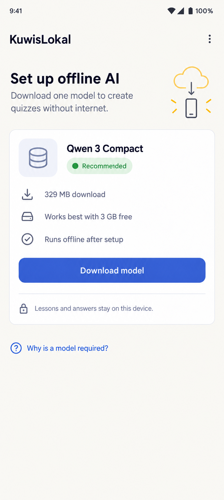
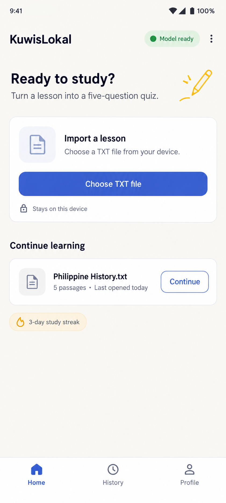
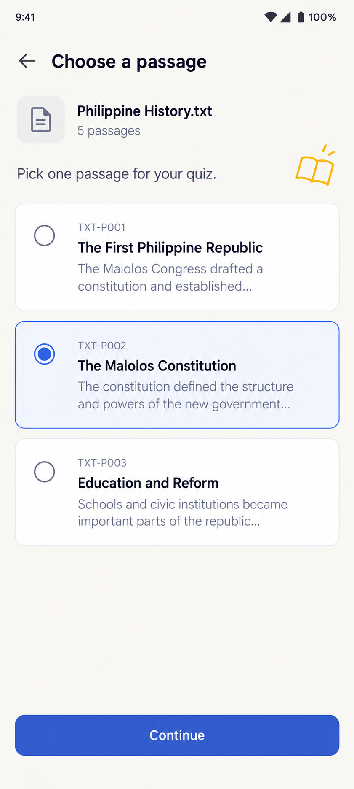
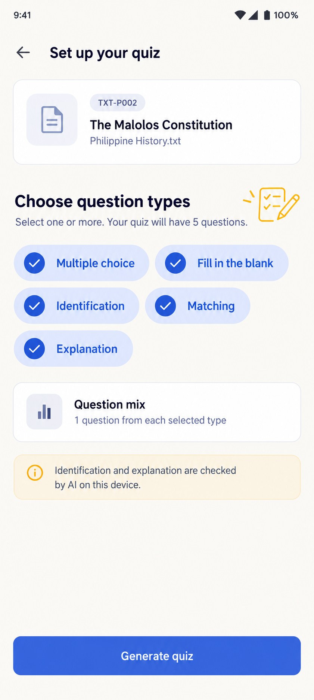
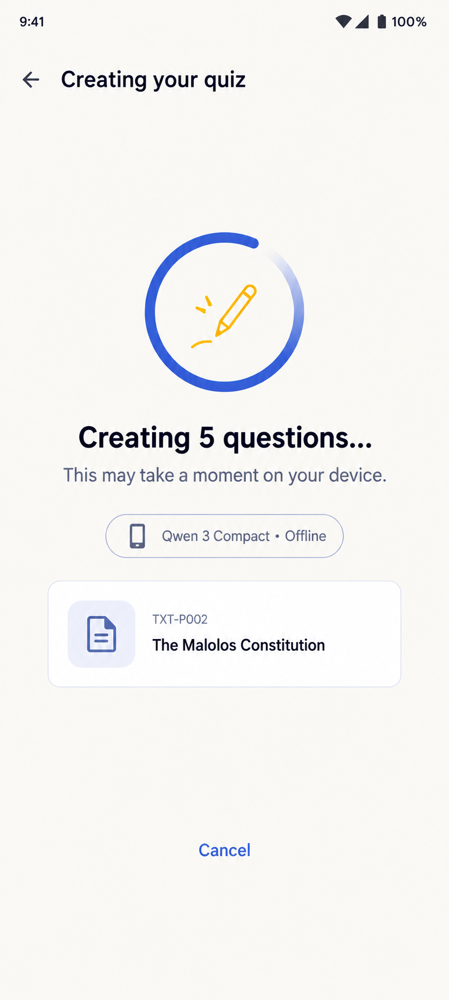
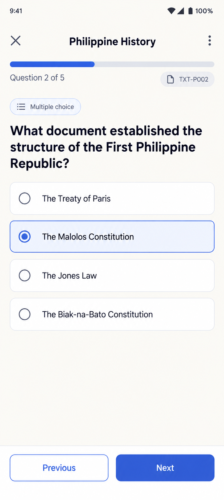
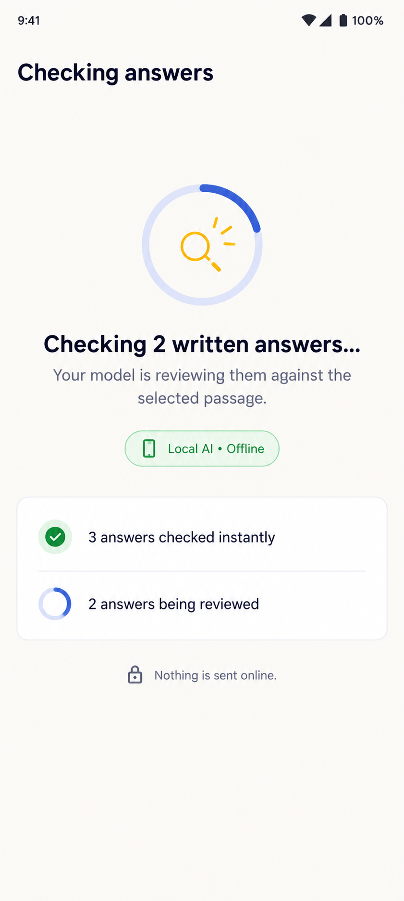
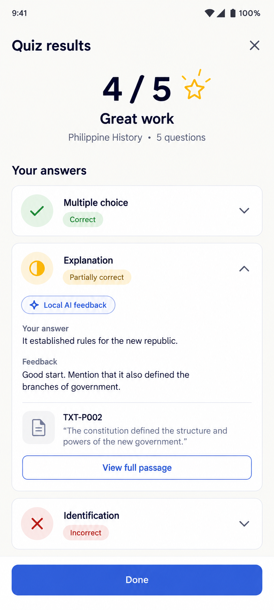
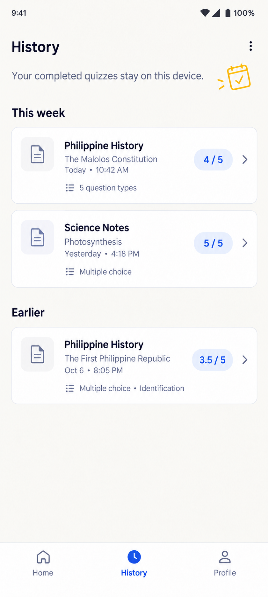
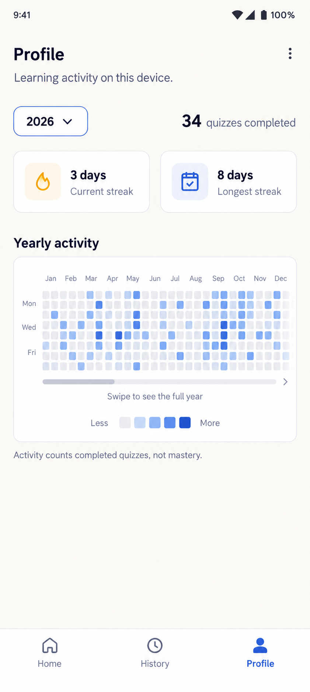

# Bukal UI Reference Gallery

These images show the approved visual direction for Bukal's ten required destinations. Use them as implementation references for hierarchy, spacing, component choice, and the intended **80% clean product UI / 20% playful personality** balance.

The images are not pixel-perfect specifications and must not be bundled into the application as screenshots. Build the screens with Jetpack Compose and Material 3 using the authoritative contracts in [Quiz Types and Local Profile](../../quiz-types-and-profile.md#ui-and-interaction-direction). Example lesson names, dates, scores, and activity values are illustrative UI content rather than fixed application data. Local semantic search was added after these references; place its query and source-linked results within Home rather than inventing an eleventh permanent destination.

## Shared Direction

- Portrait Android layout designed around a 360 x 800 dp viewport
- Warm `#F8F7F2` background, white surfaces, and `#3559C7` primary actions
- Android system-style typography and at least 48 dp touch targets
- One small line-art doodle at most on normal screens
- No poster layouts, giant branding, mascots, coins, XP, leaderboards, or mastery claims
- Bottom navigation only on Home, History, and Profile
- Focused quiz-flow screens do not show bottom navigation

## 1. Model Setup and Management

## 2. Home and Material Import

## 3. Passage Selection

## 4. Quiz Setup and Type Selection

## 5. Quiz Generation

## 6. Quiz Answering

## 7. Local-AI Answer Checking

## 8. Results and Source Evidence

## 9. Attempt History

## 10. Local Profile and Yearly Activity

## Generation Brief

The set was generated as high-fidelity Android UI mockups using the approved Home page as the common style reference. Every page prompt required practical Jetpack Compose Material 3 structure, the documented colors and spacing, readable system typography, restrained notebook-style accents, honest local-processing states, and no unsupported reward or social features.
