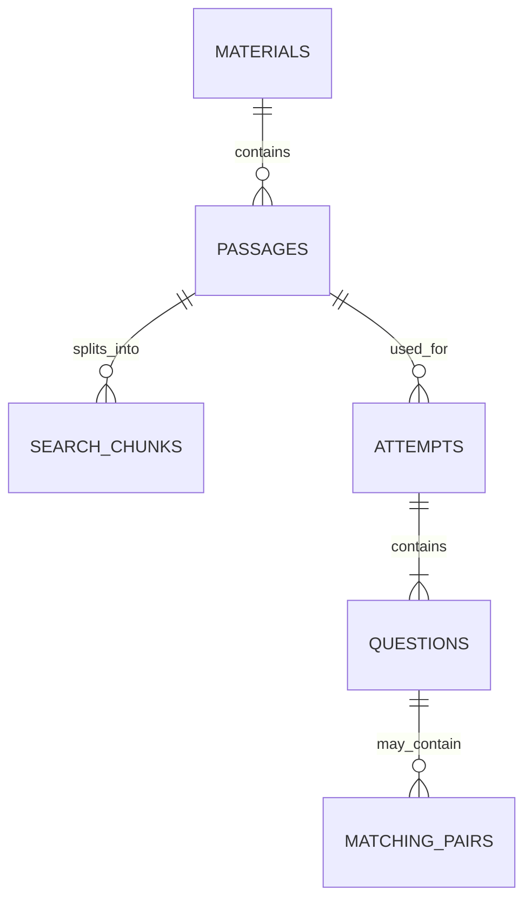

# Bukal SQLite Schema

The executable reference DDL is [`sqlite-schema.sql`](sqlite-schema.sql). It deliberately uses six tables. Retained documents and model files remain in app-specific storage, while small preferences remain in DataStore.

This contract is implemented by the Room entities, DAOs, transactions, and validators under `app/src/main/java/com/example/bukal/data/local/`. Room exports schemas 1 through 3 under `app/schemas/com.example.bukal.data.local.BukalDatabase/`; migration 1 to 2 adds generated-quiz time/status, and migration 2 to 3 adds the retained highest score without adding a seventh table.

## Supported Flow

```text
document file
  -> material metadata
  -> bounded passages
  -> overlapping search chunks
  -> one embedding per chunk
  -> semantic document search

selected passage
  -> locally generated quiz with up to five questions
  -> answers and results saved with each question
  -> History
  -> yearly activity and streaks derived from completed attempts
```

Learner responses stay in memory while answering. Immediately after a full or partial successful generation, the app saves one `saved` quiz, its one to five questions, and any matching pairs in a single Room transaction. Before generation, Bukal reuses an existing quiz for the selected passage. Checking updates that same row and child graph atomically. A retake replaces its latest responses and score, retains its highest score, and never creates another History row.

## The Six Tables

| Table | What it stores |
|---|---|
| `materials` | Imported document name, format, optional retained-file path, and import time. The actual document is not stored as a database BLOB. |
| `passages` | Ordered, bounded source text extracted from a material. Quiz evidence points back to a passage's stable `source_id`. |
| `search_chunks` | Overlapping pieces of a passage. Every chunk has its own optional embedding, so one document can produce many searchable vectors. |
| `attempts` | One saved generated quiz per passage, its quiz model ID, generation time, status, latest completion time/local date, latest score, highest score, and possible points. |
| `questions` | The generated question, type-specific answer key, learner response, boolean-derived result, and score. |
| `matching_pairs` | Expected matching pairs and the learner's selected right-side item. This is the only repeating child structure that does not fit cleanly on `questions`. |

Because schema version 1 made completion time/date non-null, a `saved` row uses its generation time/date as temporary values in those columns. The `status` column is authoritative: completion and Profile queries ignore those placeholders until the row is replaced by a `completed` attempt.

## Relationship Map



## Why the Embedding Is on `search_chunks`

The full document remains in its retained file, and each passage keeps only bounded extracted text. A passage is then split into multiple overlapping chunks. Each `search_chunks` row stores:

- `passage_id` and `chunk_index` for ordering;
- `start_offset` and exclusive `end_offset` for traceability;
- the exact chunk `content` sent to the embedding model;
- `embedding_model_id`, `embedding_dimensions`, and the vector BLOB.

The embedding fields are nullable as one group. A row with all three fields null is waiting to be indexed; a row with all three populated is searchable. This makes failed or interrupted indexing retryable without a jobs table.

The selected model is `ibm-granite/granite-embedding-311m-multilingual-r2`. Its full output has 768 dimensions and the model also supports smaller Matryoshka dimensions. The first Android implementation must benchmark retrieval quality, latency, memory use, runtime format, and device compatibility before choosing anything smaller than the full output. The chosen dimension is stored on every chunk so incompatible vectors are never compared accidentally.

Chunk size and overlap are application constants, not database columns. They must be selected using the model tokenizer and verified on representative TXT, PDF, DOCX, and PPTX imports. Re-indexing replaces the chunks for a passage in one transaction.

Until Granite tokenizer benchmarks select the final policy, import creates provisional 100-character chunks with at least 20-character adjacent overlap. Word-boundary adjustment may increase the overlap but never lets a chunk exceed 100 characters. Their exact offsets and text enter Room with all three embedding fields null. The background indexer uses LiteRT-LM on the CPU and writes all three fields only after a vector is confirmed to be finite, nonzero, L2-normalized, and exactly 768 dimensions. A failed chunk is retried once immediately and otherwise stays null for a later manual or startup retry. Once benchmarks choose the final chunk policy, re-index each passage transactionally before regenerating vectors; the schema does not need to change.

For the first local implementation, load vectors produced by the active model and calculate cosine similarity in Kotlin. Add a SQLite vector extension only if measured document sizes make this too slow.

## Question and Evaluation Shape

The five quiz types share one `questions` table:

- Multiple choice uses `option_0` through `option_3` and `correct_option_index`.
- Fill in the blank, identification, and explanation use `reference_answer`. The nullable `grading_criteria` column remains in the reviewed version-1 schema but is not required by the current generator or evaluator. The local generative quiz model evaluates the learner's `text_response`.
- Matching uses child `matching_pairs` rows. Each expected pair also holds `selected_right_id` after the learner answers.

`selected_option_index`, `text_response`, `result`, and points are stored directly on the question. The version-1 `ai_feedback` and `evaluation_evidence` columns remain nullable for schema compatibility but current boolean grading leaves them null; on-demand explanations are transient and are not persisted.

The embedding model performs semantic retrieval and does not grade answers. For open-answer grading, it retrieves up to five chunks from the selected passage; the local generative quiz model uses those matches to return only `true` or `false`, with `false` when unsure. A separate top-five retrieval and plain-text model call happens only when the learner requests an explanation. Multiple choice and matching remain deterministic.

## Profile, Heatmap, and Streaks

Profile data is derived only from `completed` rows in `attempts`; merely generating or saving a quiz does not create activity:

```sql
SELECT completed_local_date, COUNT(*) AS completed_count
FROM attempts
WHERE status = 'completed'
  AND completed_local_date BETWEEN :year || '-01-01' AND :year || '-12-31'
GROUP BY completed_local_date
ORDER BY completed_local_date;
```

The yearly heatmap uses these daily counts. Kotlin calculates current and longest streaks from the ordered dates. A profile, activity, daily-total, or streak table would duplicate data and could drift out of sync.

## Data Kept Outside SQLite

| Storage | Data |
|---|---|
| Room/SQLite | The six structured tables above. |
| DataStore | Selected quiz model ID, selected embedding model ID, and other small preferences. |
| App-specific files | Original retained documents, the local quiz model, and the Granite embedding model package. |

Neither model belongs in the APK or in SQLite. Download metadata must pin the exact artifact, runtime format, byte size, and SHA-256 checksum before implementation.

## Rules Enforced by the App

The executable reference DDL demonstrates the complete SQLite constraints. Room annotations enforce keys, parent-child ownership, nullability, uniqueness, and indexes; `DatabaseValidation` mirrors the remaining enum, range, embedding, evidence, type-shape, score, and cross-row checks before protected insert operations run:

1. A saved quiz or completed attempt contains one to five questions with contiguous positions. Saved rows contain only unanswered questions and no learner responses.
2. Every question's evidence is an exact substring of the selected passage.
3. Multiple-choice options are distinct and deterministic answers agree with the answer key.
4. Fill-in-the-blank, identification, and explanation evaluations save only correct, incorrect, or unanswered results and do not store generated feedback.
5. Generation creates three complete matching pairs; saved matching data requires at least two complete pairs, and every selected right ID belongs to that question.
6. Question points sum to the attempt totals. Correct answers earn one point; incorrect and unanswered answers earn zero out of one possible point.
7. On a `completed` row, `completed_local_date` is the real device-local calendar date captured when the attempt completes. Saved-row placeholders never enter completion queries.
8. `highest_earned_points` is at least the latest `earned_points` and never exceeds `possible_points`.
9. Search only compares vectors with the same model ID and dimensions.
10. Chunk offsets reproduce `content` from the passage and adjacent chunks overlap according to the configured policy.

These checks stay visible in repository tests instead of being hidden in database triggers.

## Delete Policy

- Deleting an unused material cascades through its passages and search chunks.
- A passage referenced by History cannot be deleted because `attempts.passage_id` uses `RESTRICT`.
- Deleting an attempt explicitly cascades to its questions and matching pairs.
- Re-import changed content as a new material instead of mutating passages that support saved evidence.

## Room Implementation Notes

- Use auto-generated `Long` IDs.
- Insert a generated graph in one `@Transaction` method. First completion and every retake update that same attempt and replace its child answer graph in one transaction.
- Index a passage by replacing its `search_chunks` rows in one transaction.
- Encode embeddings as a documented fixed-endian float array in the BLOB and verify byte length against `embedding_dimensions`.
- Keep both exported schemas and test the explicit version 1 to 2 migration.
- Test rollback, foreign-key deletion, daily aggregation, chunk overlap, vector encode/decode, model/dimension filtering, and all five question types with an in-memory Room database where appropriate.
